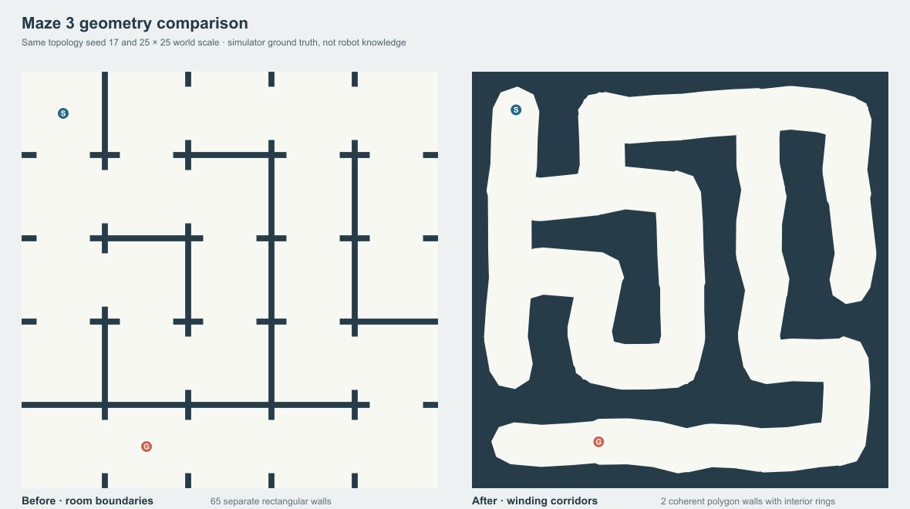
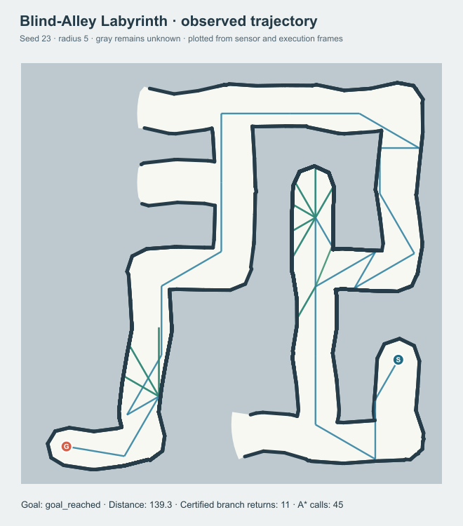

# Maze 3: irregular continuous labyrinth

The earlier Maze 3 used a seeded spanning tree with optional loops, but placed
thin axis-aligned slabs on room boundaries. Its large square open rooms and
repeated door pattern made the navigation task look like a room matrix. The new
default **Irregular Labyrinth** keeps that validated connectivity generator but
changes the *geometry*: jittered junctions and two controlled bends per open
link form a network of polygon corridors. The robot still moves between
arbitrary continuous points and plans on a visibility graph using the existing
C++ A* core. It never receives the generation lattice or hidden walls.



The [editable SVG source](images/maze3-before-after.svg) has identical 25 × 25
world scale on both sides. It is a **simulator geometry render**, not the robot's
map. The actual UI begins gray and reveals only sensed free space and boundary
fragments. A representative observation and executed trace is below.



The [observation SVG](images/labyrinth-observed-trace.svg) is generated from
sensor and movement frames, without any hidden wall coordinates.

## Generator and validation

`backend/app/services/bar_labyrinth.py` calls the existing spanning-tree-plus-
loops generator for topology and endpoint choice. A separate RNG stream,
derived from the seed, offsets each junction by at most `0.42 × irregularity`
world units. Each open connection gets two mildly displaced intermediate
points and width variation of at most 10% of `irregularity`. Buffering those
polylines with low-segment round joins produces walkable corridors. Subtracting
their union from the world rectangle produces coherent polygon obstacles,
including interior rings around wall islands. Shapely was already a project
dependency. The slight faceting is deliberate: these are valid polygon walls,
not raster cells or decorative SVG strokes.

Validation checks polygon validity, a single connected free region, strict
free start/goal positions, collision-free centerline segments, and blocked
separators between every closed pair of neighboring topology cells. Invalid
topology/geometry produces an explicit 422 API error; the generator does not
run the navigation policy to select an easier seed. In a 20-seed geometry sweep
at size 5 and maximum irregularity, widths 1.2, 2.8, and 3.2 produced 20, 19,
and 18 valid maps respectively. The rejected widest cases had accidental
closed-boundary openings. Width is capped at 3.2, and values above it are
rejected rather than silently narrowed.

| UI selection | Seed | Size | Width | Irregularity | Loops | Dead ends |
| --- | ---: | ---: | ---: | ---: | ---: | ---: |
| Exploration Labyrinth | 17 | 5 | 2.65 | 0.68 | 1 | 4 |
| Blind-Alley Labyrinth | 23 | 5 | 2.4 | 0.72 | 1 | 5 |
| Complex Irregular Labyrinth | 2026 | 6 | 2.05 | 0.88 | 3 | 5 |

The seeded UI exposes seed, size 4–8, width 1.2–3.2, loop rate 0–0.35,
dead-end preservation 0–1, irregularity 0–1, trap minimum 1–8, and difficulty.
Optional start/goal cells name junctions; their actual positions are jittered
continuous coordinates. Equal seed and full configuration reproduce the same
walls, start, and goal. The older `maze_*` API and UI scenarios remain intact.

## Sensing, planning, recovery, and display

`ContinuousWorld` now accepts validated Shapely polygons with interior rings
as well as the previous simple vertex tuples. The sensor casts against both
exterior and interior wall edges. It sends only certified free triangles,
visible wall fragments, and candidate scan positions to the controller. The
controller has no `world`, wall polygons, lattice, or collision oracle. Its
visibility edges are restricted to the discovered free region; the simulator
checks each executed segment against actual walls. Movement cost is executed
Euclidean length. The point robot has zero radius.

The parent-aware return mechanism tries C++ A* through discovered free space
when no currently reachable useful candidate remains. Failed graph targets
are deferred and labeled separately from exhausted branches; sensing during
retreat preserves newly found candidates at the surviving ancestor. See the
[backtracking audit and execution trace](bar-parent-backtracking-audit.md).
The controller accepts an A* route only if it is verified and no longer than the
recorded entry trajectory; otherwise it reverses that trajectory. The return
is fully executed before exploration resumes. The invariant concerns this
local branch and the *executed* path, not every geometric blind-alley region.
The presets below used A* for every recorded return, and all recorded returns
passed the length check. Success on these seeds is not a completeness or
global-optimality guarantee in an unknown environment.

The default UI shows light certified corridors, gray unknown space, dark
observed wall ribbons, robot heading, the active A* route, recent movement,
entry, and retreat. Full trail and visibility graph are opt-in. The dark wall
ribbons are rendered from **observed boundary fragments**; the UI does not
fill an unsensed wall island with hidden ground-truth geometry. SVG polylines
now explicitly set `fill="none"`. Without that attribute or CSS, SVG's default
fill would close an open trail into a dark triangle. The remaining small
triangular gray gaps in sensed floor are conservative ray-fan wedges rejected
by the sensor's collision test, not a malformed wall polygon or filled path.

## Reproducible experiment

From the repository root with the existing environment and C++ extension:

```powershell
.venv\Scripts\python.exe scripts\benchmark_bar_labyrinth.py --radii 5 7 | Set-Content docs\bar-labyrinth-results.csv
.venv\Scripts\python.exe scripts\render_bar_labyrinth.py
```

The complete machine-readable matrix, including frame count, compact JSON
bytes, polygon/vertex counts, graph size, A* calls, expanded nodes, turns,
planning time, and wall time, is [bar-labyrinth-results.csv](bar-labyrinth-results.csv).
One local Windows run on 2026-10-09 produced:

| Case | Radius | Goal | Executed distance | Certified / returns | A* calls | Frames | JSON | Wall time |
| --- | ---: | :---: | ---: | ---: | ---: | ---: | ---: | ---: |
| Old room showcase | 5 | yes | 213.231 | 11 / 11 | 56 | 192 | 334 KB | 1.320 s |
| Irregular exploration | 5 | yes | 120.191 | 4 / 4 | 35 | 115 | 285 KB | 1.385 s |
| Irregular blind alley | 5 | yes | 139.321 | 11 / 11 | 45 | 159 | 415 KB | 2.031 s |
| Irregular complex | 5 | yes | 370.767 | 42 / 42 | 124 | 466 | 1.21 MB | 10.270 s |
| Irregular complex | 7 | yes | 97.044 | 3 / 3 | 22 | 74 | 209 KB | 0.626 s |

These cases differ in physical corridors and exploration order. Their
distances are **not** paired shortest-path improvements over the old maze.
Increasing sensor radius may change exploration order, so the radius-7 route
need not be shorter. C++ planning times in the matrix are much smaller than
wall time; repeated geometric sensing and discovered-region operations
dominate the complex radius-5 run. The 466-frame / 1.21 MB response is a
measured playback cost, not a hidden graph payload; graph debug is off by
default. The older fixed scenarios and their benchmark results are preserved.

## Validation

`tests/test_bar_labyrinth.py` covers same-seed wall/start/goal reproduction,
polygon validity, connected walkable space, centerline clearance, closed-cell
separators, angled wall occlusion, ground-truth isolation, ten additional
seeds, varying loop/dead-end settings, two sensing radii, collision-free
executed segments, A* recovery and retreat accounting, and API privacy.
The frontend test covers seeded parameters, unfilled wall paths, and
step/restart playback. The live UI was checked at initial and terminal frames
for exploration and at the terminal frame of the 466-frame complex run;
the displayed robot matched the terminal backend position.

The complete regression on 2026-10-09 used:

```powershell
.venv\Scripts\ctest.exe --test-dir build-cpython --output-on-failure
.venv\Scripts\python.exe -m pytest -q tests
cd frontend
npm test
npm run build
npm run lint
```

Results after the [backtracking correction](bar-parent-backtracking-audit.md):
4/4 C++ tests, 113/113 Python tests, 32/32 frontend tests,
successful frontend build and lint. Python reported one existing
Starlette/httpx deprecation warning. Road Navigation, Grid BAR, original
polygon scenarios, the CSV importer, and the generic A* source were not
changed.

## Limits

- A coarse lattice chooses corridor connectivity, but the robot's planner
  uses continuous certified visibility, not lattice moves.
- Closed-cell separator checks prevent unintended neighboring openings;
  extreme valid geometry may still create visually narrow corners. Invalid
  configurations fail explicitly.
- The finite 72-ray fan plus visible-vertex rays conservatively omits some
  free space. It does not certify every visible point.
- The policy can terminate at its step budget or with no reachable frontier.
  Its local branch-return certificate is not a general polygonal BAR theorem.
- Wall time and frontend playback cost depend on the host and browser.
  Larger or denser seeded maps may require substantially longer runs.
